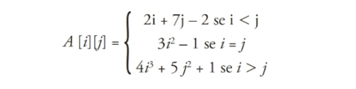

# Exercícios: Vetores e Matrizes

**1)** Crie um programa que leia do teclado seis valores inteiros e em seguida mostre na tela os valores lidos.

>[`solução`](ex001.c)

**2)** Crie um programa que leia do teclado seis valores inteiros e em seguida mostre na tela os valores lidos na ordem inversa.

>[`solução`](ex002.c)

**3)** Faça um programa que leia cinco valores e os armazene em um vetor. Em seguida, mostre todos os valores lidos com a média dos valores.

>[`solução`](ex003.c)

**4)** Faça um programa que possua um array de nome A que armazene seis números inteiros. O programa deve executar os seguintes passos:
- Atribua os seguintes valores a esse array: 1, 0, 5, –2, –5, 7.
- Armazene em uma variável a soma dos valores das posições `A[0], A[1] e A[5]` do array e mostre na tela essa soma.
- Modifique o array na posição `4`, atribuindo a essa posição o valor 100.
- Mostre na tela cada valor do array A, um em cada linha.

>[`solução`](ex004.c)

**5)** Faça um programa que leia um vetor de oito posições. Em seguida, leia também dois valores *X* e *Y* quaisquer correspondentes a duas posições no vetor. Seu programa deverá exibir a soma dos valores encontrados nas respectivas posições *X* e *Y*.

>[`solução`](ex005.c)

**6)** Escreva um programa que leia do teclado um vetor de 10 posições. Escreva na tela quantos valores pares foram armazenados nesse vetor.

>[`solução`](ex006.c)

**7)** Faça um programa que receba do usuário um vetor X com 10 posições. Em seguida deverão ser impressos o maior e o menor elemento desse vetor.

>[`solução`](ex007.c) problema [semelhante](../loopStructures/ex009.c)

**8)** Faça um programa que preencha um vetor com 10 números reais. Em seguida, calcule e mostre na tela a quantidade de números negativos e a soma dos números positivos desse vetor.

>[`solução`](ex008.c)

**9)** Faça um programa que receba do usuário dois arrays, A e B, com 10 números inteiros cada. Crie um novo array C calculando C = A – B. Mostre na tela os dados do array C.

>[`solução`](ex009.c)

**10)** Faça um programa que preencha um vetor de tamanho 100 com os 100 primeiros números naturais que não são múltiplos de 7. Ao final, imprima esse vetor na tela.

<!-- >[`solução`](ex00.c) -->

**11)** Leia um conjunto de números reais, armazenando-o em vetor. Em seguida, calcule o quadrado de cada elemento desse vetor, armazenando esse resultado em outro vetor. Os conjuntos têm, no máximo, 20 elementos. Imprima os dois conjuntos de números.

<!-- >[`solução`](ex00.c) -->

**12)** Faça um programa que leia um vetor de 10 posições. Verifique se existem valores iguais e os escreva na tela.

<!-- >[`solução`](ex00.c) -->

**13)** Faça um programa para ler 10 números diferentes a serem armazenados em um vetor. Os números deverão ser armazenados no vetor na ordem em que forem lidos, sendo que, caso o usuário digite um número que já foi digitado, o programa deverá pedir a ele para digitar outro número. Note que cada valor digitado pelo usuário deve ser pesquisado no vetor, verificando se ele existe entre os números que já foram fornecidos. Exiba na tela o vetor final que foi digitado.

<!-- >[`solução`](ex00.c) -->

**14)** Faça um programa que calcule o desvio-padrão d de um vetor V contendo n números

em que m é a média desse vetor. Considere n = 10. O vetor v deve ser lido do teclado.

  

<!-- >[`solução`](ex00.c) -->

**15)** Leia um vetor com 10 números de ponto flutuante. Em seguida, ordene os elementos desse vetor e imprima o vetor na tela.

<!-- >[`solução`](ex00.c) -->

## Matrizes

**16)** Faça um programa que leia uma matriz de tamanho 3 × 3. Imprima na tela o menor valor contido nessa matriz.

<!-- >[`solução`](ex00.c) -->

**17)** Faça um programa que leia uma matriz de tamanho 4 × 4. Imprima na tela o maior valor contido nessa matriz e a sua localização (linha e coluna).

<!-- >[`solução`](ex00.c) -->

**18)** Faça um programa que declare uma matriz de tamanho 5 × 5. Preencha com 1 a diagonal principal e com 0 os demais elementos. Ao final, escreva a matriz obtida na tela.

<!-- >[`solução`](ex00.c) -->

**19)** Leia uma matriz de tamanho 4 × 4. Em seguida, conte e escreva na tela quantos valores maiores do que 10 ela possui.

<!-- >[`solução`](ex00.c) -->

**20)** Leia uma matriz de tamanho 4 × 4. Em seguida, conte e escreva na tela quantos valores negativos ela possui.

<!-- >[`solução`](ex00.c) -->

**21)** Leia uma matriz de tamanho 3 × 3. Em seguida, imprima a soma dos valores contidos em sua diagonal principal.

<!-- >[`solução`](ex00.c) -->

**22)** Leia uma matriz de tamanho 3 × 3. Em seguida, imprima a soma dos valores contidos em sua diagonal secundária.

<!-- >[`solução`](ex00.c) -->

**23)** Calcular e imprimir na tela uma matriz de tamanho 10 × 10, em que seus elementos são da forma:

  

<!-- >[`solução`](ex00.c) -->

 
 

---
[voltar ao Topo :top:](#exercícios-vetores-e-matrizes)