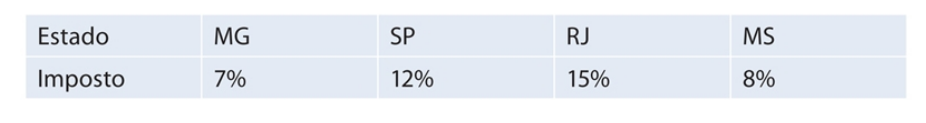
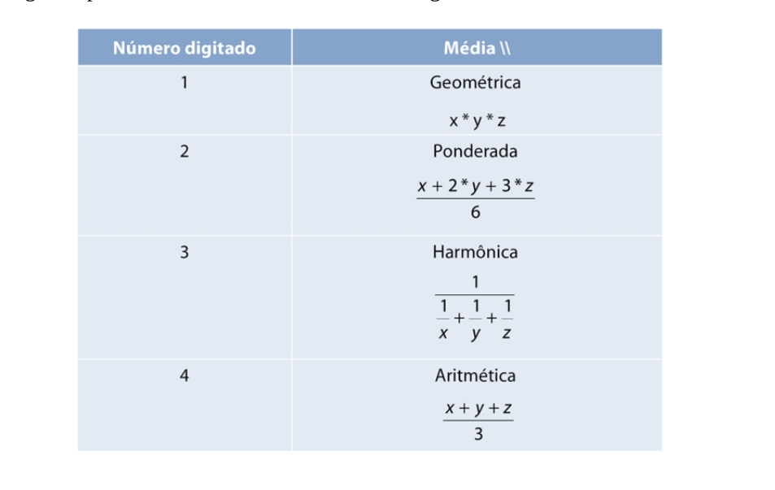

# Lista de Exercícios de Estruturas de Controle

**1)** Faça um programa que leia dois números e mostre qual deles é o maior.
> [`solução`](ex001.c)

**2)** Faça um programa que leia dois números e mostre o maior deles. Se, por acaso, os dois números forem iguais, imprima a mensagem “Números iguais”.
> [`solução(já feita na anterior)`](ex001.c)

**3)** Faça um programa que leia um número inteiro e verifique se esse número é par ou ímpar.
> [`solução`](ex003.c)

**4)** Faça um programa que leia o salário de um trabalhador e o valor da prestação de um empréstimo. Se a prestação:
- For maior que 20% do salário, imprima: “Empréstimo não concedido.”
- Caso contrário, imprima: “Empréstimo concedido.”
> [`solução`](ex004.c)

**5)** Faça um programa que leia um número e, caso ele seja positivo, calcule e
mostre:
- O número digitado ao quadrado.
- A raiz quadrada do número digitado.
> [`solução`](ex005.c) pra compilar e executar no linux é necessário add o parametro **-lm** para o compilador linkar a bliblioteca **math**. Ex.:
> ```bash
>gcc ex005.c -lm -o ex005.out && ./ex005.out
> ```

**6)** Faça um programa que receba a altura e o sexo de uma pessoa e calcule e mostre seu peso ideal, utilizando as seguintes fórmulas (em que “h” corresponde à altura):
- Homens: (72,7 * h) – 58
- Mulheres: (62,1 * h) – 44,7
> [`solução`](ex006.c)

**7)** Uma empresa vende o mesmo produto para quatro diferentes estados. Cada estado possui uma taxa diferente de imposto sobre o produto. Faça um programa em que o usuário entre com o valor e o estado de destino do produto e o programa retorne o preço final do produto acrescido do imposto do estado em que ele será vendido. Se o estado digitado não for válido, mostrará uma mensagem de erro.
<!-- > [`solução`](ex00.c) -->
<div align="center">

  

</div>

**8)** Escreva um programa que, dada a idade de um nadador, classifique-o em uma das seguintes categorias:
<!-- > [`solução`](ex00.c) -->
<div align="center">

  

</div>

**9)** Faça um programa que leia a altura e o peso de uma pessoa. De acordo com a tabela a seguir, verifique e mostre qual a classificação dessa pessoa.
<!-- > [`solução`](ex00.c) -->


**10)** Faça um programa que leia três números inteiros positivos e efetue o cálculo de uma das seguintes médias de acordo com um valor numérico digitado pelo usuário e mostrado na tabela a seguir:
<div align="center">

  

</div>

> [`solução`](ex010.c)


**11)** Faça um programa que informe o mês de acordo com o número digitado pelo usuário. Exemplo:
> Entrada = 4.
> Saída = Abril.
<!-- > [`solução`](ex00.c) -->

**12)** Usando o comando switch, escreva um programa que leia um inteiro entre 1 e 7 e imprima o dia da semana correspondente a esse número. Isto é, domingo, se 1, segunda-feira, se 2, e assim por diante.
<!-- > [`solução`](ex00.c) -->

**13)** Faça um programa que mostre ao usuário um menu com quatro opções de operações matemáticas (as operações básicas, por exemplo). O usuário escolhe uma das opções, e o seu programa pede dois valores numéricos e realiza a operação, mostrando o resultado.
<!-- > [`solução`](ex00.c) -->

**14)** Faça um programa para verificar se determinado número inteiro lido é divisível por 3 ou 5, mas não simultaneamente pelos dois.
<!-- > [`solução`](ex00.c) -->

**15)** Faça um programa que leia os coeficientes de uma equação do segundo grau. Em seguida, calcule e mostre as raízes dessa equação, lembrando que as raízes são calculadas como: em que Δ = b2 – 4 * a * c e ax2 + bx + c = 0 representa uma equação do segundo grau. A variável a tem de ser diferente de zero. Caso seja igual, imprima a mensagem “Não é equação de segundo grau”. Do contrário, imprima:
- Se Δ < 0, não existe real. Imprima a mensagem “Não existe raiz”.
- Se Δ = 0, existe uma raiz real. Imprima a raiz e a mensagem “Raiz única”.
- Se Δ > 0, existem duas raízes reais.
Imprima as raízes.
<!-- > [`solução`](ex00.c) -->
<div align="center">

  

</div>