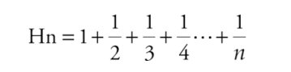
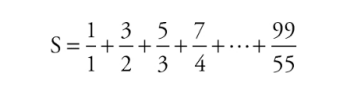
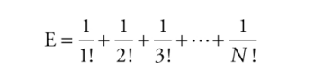

# Exercícios: Estruturas de Repetição


**1)** Faça um programa que leia um número inteiro positivo N e imprima todos os números naturais de 0 até N em ordem crescente.
> [`solução`](ex001.c)

**2)** Faça um programa que leia um número inteiro positivo N e imprima todos os números naturais de 0 até N em ordem decrescente.
> [`solução`](ex002.c)

**3)** Faça um programa que leia um número inteiro N e depois imprima os N primeiros números naturais ímpares.
> [`solução`](ex003.c)

**4)** Faça um programa que determine e mostre os cinco primeiros múltiplos de 3 considerando números maiores que 0.
> [`solução`](ex004.c)

**5)** Faça um programa que calcule e mostre a soma dos 50 primeiros números pares.
> [`solução`](ex005.c)

**6)** Faça um programa que mostre uma contagem regressiva na tela, iniciando em 10 e terminando em 0. Mostre uma mensagem “FIM!” após a contagem.
> [`solução`](ex006.c)

**7)** Elabore um programa que peça ao usuário para digitar 10 valores. Some esses valores e apresente o resultado na tela.
> [`solução`](ex007.c)

**8)** Faça um programa que leia 10 inteiros e imprima sua média.
> [`solução`](ex008.c)

**9)** Escreva um programa que leia 10 números e escreva o menor valor lido e o maior valor lido.
> [`solução`](ex009.c)

**10)** Faça um programa que leia 10 inteiros positivos, ignorando não positivos, e imprima sua média.
> [`solução`](ex010.c)

**11)** Faça um algoritmo que leia um número positivo e imprima seus divisores. 
Exemplo: `Os divisores do número 66 são: 1, 2, 3, 6, 11, 22, 33 e 66.`
> [`solução`](ex011.c)

**12)** Escreva um programa que leia um número inteiro e calcule a soma de todos os divisores desse número, com exceção dele próprio. 
Exemplo: `A soma dos divisores do número 66 é 1 + 2 + 3 + 6 + 11 + 22 + 33 = 78.`
> [`solução`](ex012.c)

**13)** Faça um programa que exiba a soma de todos os números naturais abaixo de 1.000 que são múltiplos de 3 ou 5.
<!-- > [`solução`](ex00.c) -->

**14)** Escreva um programa que leia um número inteiro, maior ou igual a zero, do usuário. Imprima o enésimo termo da sequência de Fibonacci. Essa sequência começa no termo de ordem zero, e, a partir do segundo termo, seu valor é dado pela soma dos dois termos anteriores. Alguns termos dessa sequência são: 0, 1, 1, 2, 3, 5, 8, 13, 21, 34.
<!-- > [`solução`](ex00.c) -->

**15)** Elabore um programa que faça a leitura de vários números inteiros até que se digite um número negativo. O programa tem de retornar o maior e o menor número lido.
<!-- > [`solução`](ex00.c) -->

**16)** Em matemática, o número harmônico designado por Hn define-se como o enésimo termo da série harmônica. Ou seja: Apresente um programa que calcule o valor de qualquer Hn.
<div align="center">



</div>
<!-- > [`solução`](ex00.c) -->

**17)** Escreva um programa que leia um número inteiro positivo N e em seguida imprima N linhas do chamado triângulo de Floyd:
```
12
3
4 5 6
8 9 10
11 12 13 14 15
16 17 18 19 20 21
```
<!-- > [`solução`](ex00.c) -->

**18)** Faça um programa que receba um número inteiro maior do que 1 e verifique se o número fornecido é primo ou não.
<!-- > [`solução`](ex00.c) -->

**19)** Faça um programa que calcule e escreva o valor de S:
<!-- > [`solução`](ex00.c) -->
<div align="center">

  

</div>

**20)** Faça um programa que leia um valor inteiro e positivo N, calcule o mostre o valor E, conforme a fórmula a seguir:
<!-- > [`solução`](ex00.c) -->
<div align="center">

  

</div>

**21)** Escreva um programa que leia certa quantidade de números, imprima o maior deles e quantas vezes o maior número foi lido. A quantidade de números a serem lidos deve ser fornecida pelo usuário.

---
[voltar ao Topo :top:](#exercícios-estruturas-de-repetição)