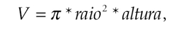

**1)** Faça um programa que leia um número inteiro e retorne seu antecessor e seu sucessor.
> [`solução`](ex001.c)

**2)** Faça um programa que leia um número real e imprima a quinta parte desse número.
> [`solução`](ex002.c)

**3)** Faça um programa que leia três valores inteiros e mostre sua soma.
> [`solução`](ex003.c)

**4)** Leia quatro valores do tipo float. Calcule e exiba a média aritmética desses valores.
> [`solução`](ex004.c)

**5)** Faça um programa que calcule o ano de nascimento de uma pessoa a partir de sua idade e do anoatual.
> [`solução`](ex005.c)

**6)** Leia uma velocidade em km/h (quilômetros por hora) e apresente convertida em m/s (metros por segundo).
> [`solução`](ex006.c)

**7)** Faça um programa que leia um valor em reais e a cotação do dólar. Em seguida, imprima o valorcorrespondente em dólares.
> [`solução`](ex007.c)

**8)** Leia um valor que represente uma temperatura em graus Celsius e apresente-a convertida em graus Fahrenheit. A fórmula de conversão é: `F = C * (9.0/5.0) + 32.0`, sendo F a temperatura em Fahrenheit e C a temperatura em Celsius.
> [`solução`](ex008.c)

**9)** Leia um ângulo em graus e apresente-o convertido em radianos. A fórmula de conversão é R = G * π/180, sendo G o ângulo em graus e R em radianos e π = 3.141592.
> [`solução`](ex009.c)

**10)** A importância de R$ 780.000,00 será dividida entre três ganhadores de um concurso, sendo que:
- O primeiro ganhador receberá 46% do total.
- O segundo receberá 32% do total.
- O terceiro receberá o restante.
Calcule e imprima a quantia recebida por cada um dos ganhadores.
> [`solução`](ex010.c)

**11)** Leia o valor do raio de um círculo. Calcule e imprima a área do círculo correspondente. A área do círculo é `A = π* raio2`, sendo **π = 3.141592**.
> [`solução`](ex011.c)

**12)** Leia a altura e o raio de um cilindro circular e imprima o volume desse cilindro. O volume de um cilindro circular é calculado por meio da seguinte fórmula:

  

> [`solução`](ex012.c)

**13)** Sejam a e b os catetos de um triângulo cuja hipotenusa h é obtida pela equação: Faça um programa que leia os valores de a e b, e calcule o valor da hipotenusa através da fórmula dada. Imprima o resultado.

  
  

> [`solução`](ex013.c)

**14)** Faça um programa que converta uma letra maiúscula em letra minúscula. Use a tabela ASCII para isso.
<!-- > [`solução`](ex010.c) -->

**15)** Faça um programa para ler um número inteiro positivo de três dígitos. Em seguida, calcule e mostre o número formado pelos dígitos invertidos do número lido. Exemplo: Número lido = 123 Número gerado = 321
<!-- > [`solução`](ex010.c) -->

**16)** Escreva um programa que leia um número inteiro e mostre a multiplicação e a divisão desse número por dois (utilize os operadores de deslocamento de bits).
<!-- > [`solução`](ex010.c) -->

**17)** Escreva um programa que leia um número inteiro e mostre o seu complemento bit a bit.
<!-- > [`solução`](ex010.c) -->

**18)** Elabore um programa que leia dois números inteiros e exiba o deslocamento, à esquerda e à direita, do primeiro número pelo segundo.
<!-- > [`solução`](ex010.c) -->

**19)** Elabore um programa que leia dois números inteiros e exiba o resultado das operações de “ou exclusivo”, “ou bit a bit” e “e bit a bit” entre eles.
<!-- > [`solução`](ex010.c) -->
